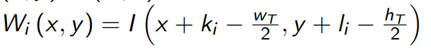
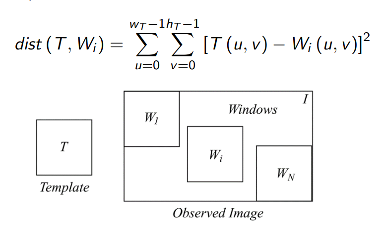
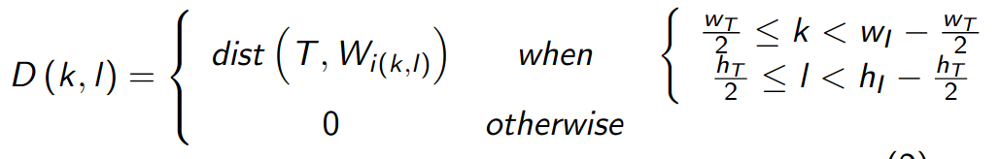
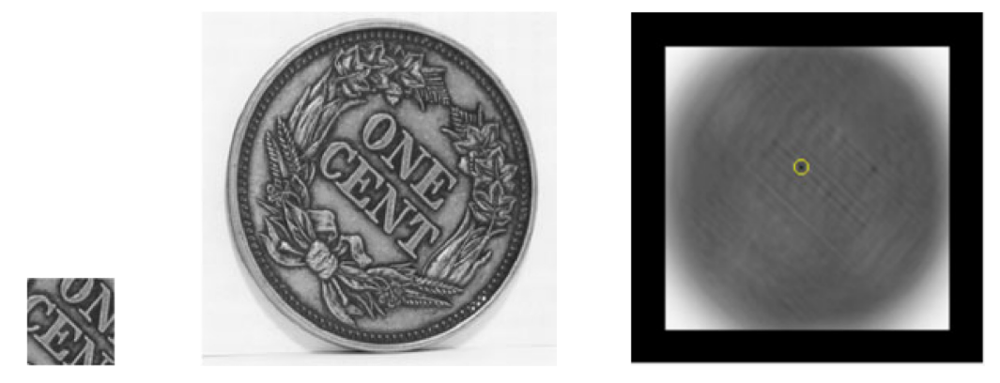

Laboratorio IV Sistemas Operativos 2 
### Ingeniería en Computación - FCEFyN - UNC
# Memoria compartida

## Introducción
Los niveles de integración electrónica han permitido la generación de procesadores de arquitecturas multiprocesos, multicore, híbridos y ahora many integrated core (MIC). Este avance hace necesario que los programadores cuenten con un profundo conocimiento del hardware sobre el que se ejecutan sus programas, y que dichos programas ya no pueden ser monoproceso.

Entre las técnicas y estándares más utilizados para sistemas de memoria compartida y memoria distribuida, se encuentra OpenMP y MPI respectivamente.

## Objetivo
El objetivo del presente trabajo práctico es que el estudiante sea capaz diseñar una solución que utilice el paradigma de memoria distribuida, utilizando OpenMP, en lenguaje C.

## Desarrollo
### Problema a desarrollar
Se pide que se diseñe, valide e implemente un programa que realice un algoritmo de [reconocimiento de patrones](https://en.wikipedia.org/wiki/Pattern_recognition) en imágenes, utilizando el lenguaje C y la librería OpenMP.

Dentro de la carpeta img, se encuentrean dos archivos de imágenes, que llamaremos _I_ a la imagen principal y _T_ al patrón que debemos encontrar. 

Se debe implem entar un algoritmo simple que consite en definir una ventana (_window_) de iguales dimensiones que _T_ (wT x hT), que se desplaza por toda la imagen.

Si el centro de la ventana  Wi es el par (Ki, Ii), entonces podemos definir:

Para cada ventana Wi se computa la distancia euclideana entre T y Wi utilizando:

Luego, se debe crear un mapa de distancias, donde cada punto es la distancia entre  Wi y T.

Por último, se debe seleccionar la posición del mínimo en ese mapa y reportar las coordenadas donde se encuentra.

### Restricciones
Las imágenes deben tratarse cono matrices em R2 monocromática y es opcional de ustedes convertirlas en un formato amigable para la tarea.
El diseño debe contemplar toda situación no descripta en el presente documento y se debe hacer un correcto manejo de errores.
El diseño debe ser dinámico, y debe adaptarse a distintas imagenes de distintos tamañaos.

### Criterios de Corrección
- Se debe compilar el código con los flags de compilación: 
     -Wall -Pedantic -Werror -Wextra -Wconversion -std=gnu11
- La correcta gestion de memoria.
- Dividir el código en módulos de manera juiciosa.
- Estilo de código.
- Manejo de errores
- El código no debe contener errores, ni warnings.
- El código no debe contener errores de cppcheck.

## Entrega
Como metodología para resolver este problema, se solicita que, primero, se realice un diseño que sea solución al problema sin explotar el paralelismo (procedural). Luego, a partir de este, realizar una nueva implementación que realice el proceso mediante el uso de la librería OpenMP, explotando el paralelismo del problema. Para ello, se requiere reconocer qué tipo de paralelismo exhibe el problema en cuestión y luego, diseñar la solución del mismo determinando cuáles son los datos/operaciones paralelizables. Se tendrá en cuenta, el nivel de paralelismo alcanzado.

La entrega se hace a travéz del repositorio de GitHub y se deberá demostrar la realizacion del mismo mediante un correcto uso. El repositorio deberá proveer los archivos fuente y cualquier otro archivo asociados a la compilación, archivos  de  proyecto  ”Makefile”  y  el  código correctamente documentado. No debe contener ningún archivo asociado a proyectos de un IDE y se debe asumir que el proyecto podrá ser compilado y corrido por una `tty` en una distribución de Linux con las herramientas típicas de desarrollo. También se deberá entregar un informe (que pude ser en MD en el repo) explicando paso a paso el desarrllo, inluyendo graficos del diseño solución propuesto, justificando en todo momento lo implementrado.
También se deberá investigar acerca de qué utilidades de profiling gratuitas existen y que brinda cada una (un capítulo del informe), optando por una para realizar las mediciones de tiempo de ejecución de la aplicación diseñada.

El informe (markdown) debe contener gráficos y análisis de comparación entre la ejecución procedural y la distribuida, mostrando la escalabilidad y el speedup del mismo. El informe además debe contener el diseño de la solución y la comparativa de profilers.

## Links
- [Introduction to parallel programming](https://hpc.llnl.gov/documentation/tutorials/introduction-parallel-computing-tutorial)
- [OpenMP Tutorial](https://hpc-tutorials.llnl.gov/openmp/)
